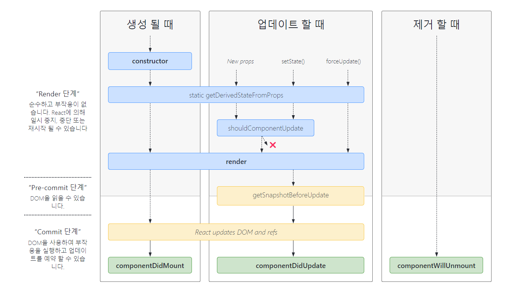
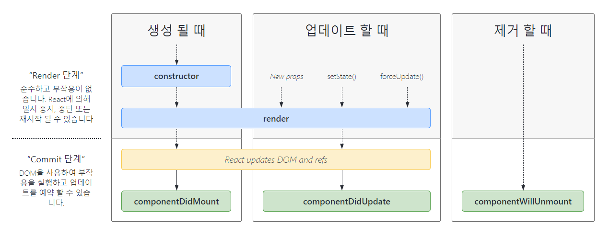

# 컴포넌트 생명주기(라이프 사이클)에 대해 분석해보자 🎯

## 참고 주소

- [리액트 라이프 사이클](https://velog.io/@remon/React-%EB%A6%AC%EC%95%A1%ED%8A%B8-%EB%9D%BC%EC%9D%B4%ED%94%84-%EC%82%AC%EC%9D%B4%ED%81%B4)
- [리액트 라이프 사이클2](https://react.vlpt.us/basic/25-lifecycle.html/)
- [리액트 라이프 사이클3](https://laurent.tistory.com/entry/React-%EC%BB%B4%ED%8F%AC%EB%84%8C%ED%8A%B8%EC%9D%98-%EC%83%9D%EB%AA%85-%EC%A3%BC%EA%B8%B0Life-Cycle)
- [함수형 컴포넌트 라이프 사이클](https://yooneeee.tistory.com/45)
- [리액트 라이프 사이클 다이어그램](https://projects.wojtekmaj.pl/react-lifecycle-methods-diagram/)

## 라이프 사이클 순서

1. 생성(mount)
2. 업데이트(update)
3. 제거(unmount)

## 라이프 사이클 분류

### 클래스형 컴포넌트

### 함수형 컴포넌트

## 클래스형 컴포넌트

### 1. 생성(mount)

- constructor: 초기 state 설정
- static getDerivedStateFromProps: props로 받아온 값 state에 동기화
- shouldComponentUpdate: props나 state 변경시 리렌더링 여부 결정
- render: 컴포넌트가 보이는 부분 결정, 반환값을 통해 DOM 업데이트
- componentDidMount: DOM 직접 조작

### 2. 업데이트(update)

- static getDerivedStateFromProps
- shouldComponentUpdate
- render
- getSnapShotBeforeUpdate: 업데이트로부터 변경될 수 있는 DOM에서 정보 캡처하도록 함
- ComponentDidUpdate

### 3. 제거(unmount)

- ComponentWillUnmount

## 함수형 컴포넌트

리액트 생태계는 16.8 버전에서 Hook이 도입되며, 라이프 사이클 역시 변경되어 위의 내용은 legacy가 되었다.

해당 내용은 useEffect가 대체하게 되었다.

### 1. 생성(mount)

- componentDidMount

### 2. 업데이트(update)

- componentDidUpdate

### 3. 제거(unmount)

- componentWillUnmount
