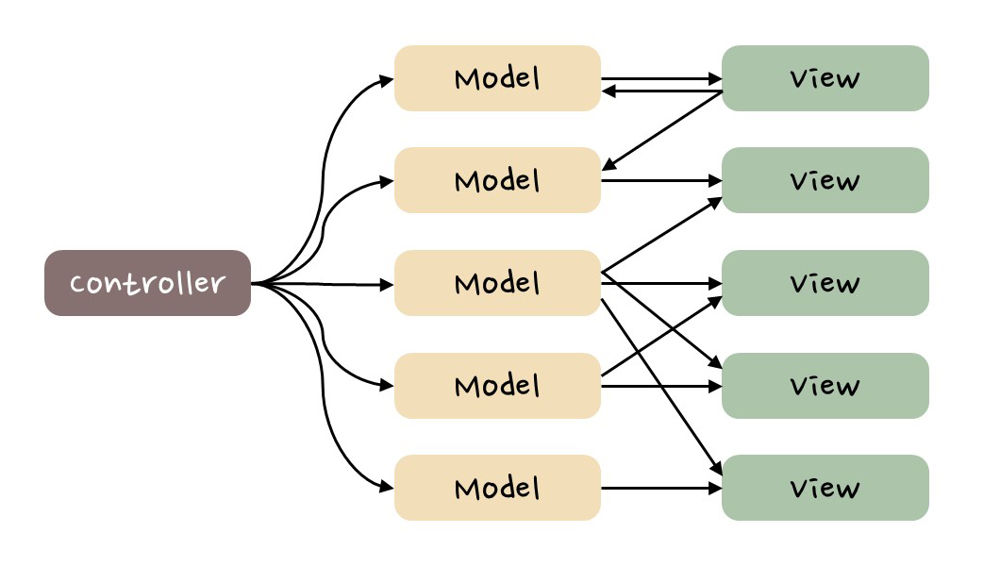

# Redux를 분석해보자 🎯

## 참고 주소

- [Quick Start](https://redux-toolkit.js.org/tutorials/quick-start)
- [MVC 패턴 VS Flux 패턴](https://www.tcpschool.com/react/react_redux_intro#google_vignette)

## Redux란 무엇인가

### MVC 패턴 VS Flux 패턴

- MVC: 양방향으로 데이터 주고 받기 가능
  - Model: 데이터 저장
  - Controller: Model의 데이터 관리
  - View: 사용자가 데이터 확인, 사용자가 데이터 입력
  - View를 통해 Model에 데이터 관리를 진행할 수 있어서, 양방향으로 데이터 전달됨 ⚠️
    
- Flux: 단방향으로 데이터 주고 받기 가능(예측 가능성 높임)
  - Store: 데이터 저장
  - Action: Dispatcher에게 전달될 객체(Action의 타입+새로운 데이터)
  - Dispatcher: Store의 데이터 관리
  - View: 사용자 데이터 확인, 사용자 데이터 입력
    

### Redux에 적용된 Flux 패턴

- Store: 데이터 저장
- Reducer
  - Action을 받아 Store 상태를 변경하는 함수
  - 이전 State와 Action을 받아 새로운 State를 반환
  - Dispatcher가 없는 대신 존재함 ⚠️
- Aciton: 상태를 변경하기 위한 이벤트를 나타내는 객체
- Dispatch: Action이 Dispatch되면 Store가 업데이트됨
- View=UI

> 순서: View > Action > Dispatch > Reducer > Store > (newState return) > View(update)

## 설치

- 기초 환경 설정

```
yarn create vite
yarn
yarn dev
```

- Redux, Redux Toolkit 설치

```
yarn add @reduxjs/toolkit react-redux
```

## 기초 설정

1. store.ts 생성
   > store/store.ts

- configureStore
- reducer

```ts
import { configureStore } from "@reduxjs/toolkit";
export const store = configureStore({
  reducer: {},
});
```

2. Provider로 감싸기
   > main.tsx

- Provider
- store

```tsx
import { Provider } from "react-redux";
import { store } from "./store/store.ts";

createRoot(document.getElementById("root")!).render(
  <StrictMode>
    <Provider store={store}>
      <App />
    </Provider>
  </StrictMode>
);
```

## Slice 설정

> counterSlice.ts, store.ts

1. 개인 Slice 생성

- createSlice
- name: key와 같은 역할
- initialState: 초기값
- reducers: 함수

```ts
import { createSlice } from "@reduxjs/toolkit";
export const counterSlice = createSlice({
  name: "counter",
  initialState: {
    count: 0,
  },
  reducers: {
    increase: (state, action) => {
      state.count += action.payload;
    },
    decrease: (state, action) => {
      state.count -= action.payload;
    },
  },
});
```

2. 개인 Slice export

- A.actions: 함수 각각을 모두 export
- A.reducer: 전체 slice를 export

```ts
export const { increase, decrease } = counterSlice.actions;
export default counterSlice.reducer;
```

3. 개인 Slice를 전체(Store)에 반영

- configureStore
- reducer: `별칭`: `실제 export한 Slice`의 형태로 구성

```ts
import counterSlice from "./counterSlice";
export const store = configureStore({
  reducer: {
    counter: counterSlice,
  },
});
```

## Slice 활용

> CounterPage.tsx

1. 변수 불러오기

- useSelector: `state.별칭.초기값의 key`의 형태로 구성

```tsx
const count = useSelector((state: StoreState) => state.counter.count);
```

2. 함수 불러오기

- useDispatch

```tsx
const dispatch = useDispatch();
```

3. 변수 사용하기

```tsx
const CounterPage = () => {
  const count = useSelector((state: StoreState) => state.counter.count);
  return (
    <section>
      <p>Count: {count}</p>
    </section>
  );
};
```

4. 함수 사용하기

- dispatch: `dispatch(함수(파라미터))`의 형태로 구성

```tsx
const CounterPage = () => {
  const dispatch = useDispatch();
  return (
    <section>
      <button onClick={() => dispatch(decrease(1))}>
        Redux Counter decrease -
      </button>
      <button onClick={() => dispatch(increase(1))}>
        Redux Counter increase +
      </button>
    </section>
  );
};
```
